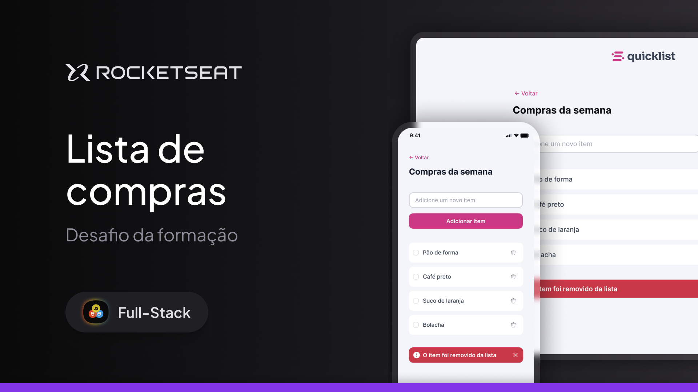

  

  <a href="#-projeto">Projeto</a>&nbsp;&nbsp;&nbsp;|&nbsp;&nbsp;&nbsp;
  <a href="#-tecnologias">Tecnologias</a>

  

 

  

## 👩🏻‍💻 Projeto

O projeto é um site responsivo de lista de compras onde o usuário pode gerenciar os itens adicionando e removendo eles. 
Esse é um dos desafio da formação Full-Stack, um dos conteúdos disponíveis para alunos da Rocketseat.

Nessa aplicação trabalhamos com:

  ✓ JavaScript  
  ✓ Manipulação da DOM  
  ✓ Funções  
  ✓ Eventos 
  
## ⚙️ Funcionalidades

- O usuário pode **adicionar** um item a lista de compras
- O usuário pode **remover** um item da lista de compras

## 🚀 Tecnologias

Esse projeto foi desenvolvido com as seguintes tecnologias:

- Javascript
- HTML
- CSS

## 

 Feito com 💜 by Palloma Gualter :wave:

